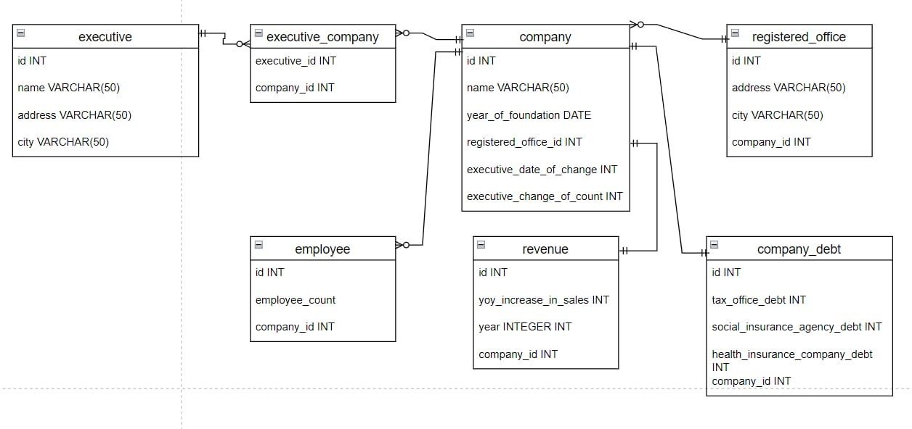

# Potential Riskiness of Shell Companies



*Figure 1: Entity-Relationship (ER) Diagram of the application's database structure.*

**Potential Riskiness of Shell Companies** is a web application designed to help businesses and individuals assess the
risk associated with partnering with other companies. This platform allows users to quickly and easily access
information about a company and evaluate its potential risk factors.

## Key Features

- **Company Database**: The platform contains an extensive database of companies, where users can search and browse
  individual companies. Each company profile provides a detailed overview, including a risk score that indicates the
  level of potential risk associated with partnering with that company.

- **Risk Score**: Each company is assigned a risk score based on various factors such as financial indicators, company
  history, debts, and other relevant information. This score helps users better understand whether collaborating with a
  specific company is safe.

- **Statistics**: The application includes a section with various statistics that provide an overview of the companies
  in the database, such as the distribution of risk scores, the most risky sectors, and other relevant metrics.

- **Data Management**: The ability to add new companies to the database is restricted to government employees. This
  ensures that the data in the database is up-to-date, accurate, and trustworthy.

## Installation and Setup

1. Clone the repository:
    ```bash
    git clone https://github.com/your-repo/potential-riskiness-of-shell-companies.git
    ```

2. Create and activate a virtual environment:
    ```bash
    python -m venv venv
    source venv/bin/activate  # On Windows use `venv\Scripts\activate`
    ```

3. Install dependencies:
    ```bash
    pip install -r requirements.txt
    ```

4. Apply database migrations:
    ```bash
    python manage.py migrate
    ```

5. Start the development server:
    ```bash
    python manage.py runserver
    ```

6. Visit the application in your browser at `http://127.0.0.1:8000/`.

## Usage

- After launching the application, you can browse the company database and view detailed information, including the risk
  score.
- If you are a government employee, you can log in and add new companies to the database through the admin interface.